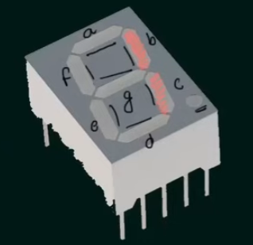
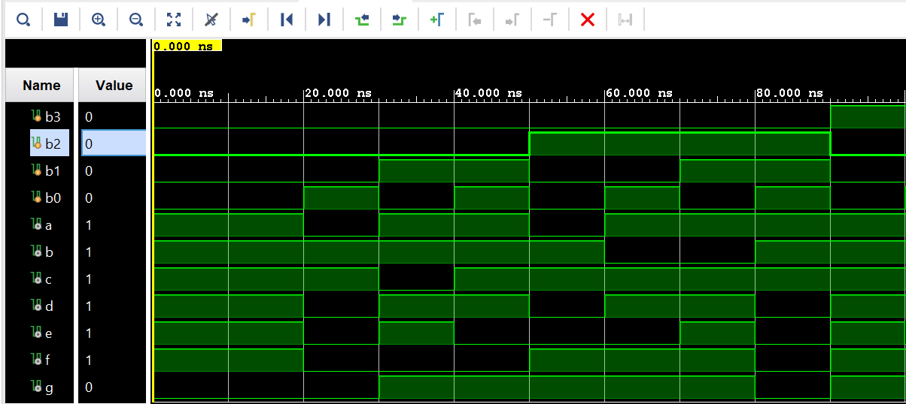

# 7-Segment Display Decoder

A Verilog implementation of a 4-bit BCD to 7-segment display decoder, developed in Vivado IDE. This document provides theory, derivations, and simulation results for the circuit.

---

## Table of Contents

- [What Is a 7-Segment Display Decoder?](#what-is-a-7-segment-display-decoder)
- [Learning Resources](#learning-resources)
- [Truth Table](#truth-table)
- [K-Maps](#k-maps)
- [Simplified Boolean Equations](#simplified-boolean-equations)
- [Circuit Diagram](#circuit-diagram)
- [Waveform Diagram](#waveform-diagram)
- [Testbench Output](#testbench-output)
- [Project Files](#project-files)

---

## What Is a 7-Segment Display Decoder?

A **7-segment display decoder** is a combinational circuit that converts a **4-bit binary** (BCD) input into the appropriate signals to drive a **7-segment display**. Each of the seven segments (labeled **a** through **g**) is an LED that can be on (1) or off (0). The decoder takes the 4-bit value (b₃, b₂, b₁, b₀), typically representing decimal digits 0–9, and drives the segments so that the correct digit is shown.

- **Input:** Four bits b₃b₂b₁b₀ (e.g. 0000 = 0, 0001 = 1, … 1001 = 9).
- **Output:** Seven signals **a, b, c, d, e, f, g**, one per segment, where 1 usually means “on” and 0 means “off.”

The standard segment layout—which letter corresponds to which segment—is shown below. Segment **a** is at the top, **b** top-right, **c** bottom-right, **d** at the bottom, **e** bottom-left, **f** top-left, and **g** in the middle. This decoder is used in digital clocks, calculators, and any device that displays numeric digits.



---

## Learning Resources

Useful online resources for 7-segment decoders and digital design:

| Resource | Description |
|----------|-------------|
| [7-Segment Display Decoder (YouTube)](https://www.youtube.com/results?search_query=7+segment+display+decoder) | Search for “7 segment display decoder” for step-by-step explanations. |
| [BCD to 7-Segment Decoder (YouTube)](https://www.youtube.com/results?search_query=BCD+to+7+segment+decoder) | Search for “BCD to 7 segment decoder” for truth tables and logic. |
| [K-Map Simplification (YouTube)](https://www.youtube.com/results?search_query=karnaugh+map+simplification) | Search for “Karnaugh map simplification” to see how segment equations are derived. |
| [Logic Gates – AND, OR, NOT (YouTube)](https://www.youtube.com/results?search_query=logic+gates+AND+OR+NOT) | Search for “logic gates” for gate behavior and truth tables. |

---

## Truth Table

The decoder output **a–g** for each 4-bit BCD input (b₃, b₂, b₁, b₀) for digits 0–9. Rows 10–15 (1010–1111) are invalid BCD; the circuit may show a pattern but are not standard decimal digits.

| **b₃** | **b₂** | **b₁** | **b₀** | **‖** | **a** | **b** | **c** | **d** | **e** | **f** | **g** |
|:------:|:------:|:------:|:------:|:-----:|:-----:|:-----:|:-----:|:-----:|:-----:|:-----:|:-----:|
| **———** | **———** | **———** | **———** | **———** | **———** | **———** | **———** | **———** | **———** | **———** | **———** |
| 0 | 0 | 0 | 0 | **\|** | 1 | 1 | 1 | 1 | 1 | 1 | 0 |
| 0 | 0 | 0 | 1 | **\|** | 0 | 1 | 1 | 0 | 0 | 0 | 0 |
| 0 | 0 | 1 | 0 | **\|** | 1 | 1 | 0 | 1 | 1 | 0 | 1 |
| 0 | 0 | 1 | 1 | **\|** | 1 | 1 | 1 | 1 | 0 | 0 | 1 |
| 0 | 1 | 0 | 0 | **\|** | 0 | 1 | 1 | 0 | 0 | 1 | 1 |
| 0 | 1 | 0 | 1 | **\|** | 1 | 0 | 1 | 1 | 0 | 1 | 1 |
| 0 | 1 | 1 | 0 | **\|** | 1 | 0 | 1 | 1 | 1 | 1 | 1 |
| 0 | 1 | 1 | 1 | **\|** | 1 | 1 | 1 | 0 | 0 | 0 | 0 |
| 1 | 0 | 0 | 0 | **\|** | 1 | 1 | 1 | 1 | 1 | 1 | 1 |
| 1 | 0 | 0 | 1 | **\|** | 1 | 1 | 1 | 1 | 0 | 1 | 1 |

---

## K-Maps

Karnaugh maps for each output **a–g** in terms of b₃, b₂, b₁, b₀. Rows are **b₃b₂**, columns are **b₁b₀**. Invalid BCD cells (10–15) are marked **N/A** and can be treated as 1 for grouping.

### Segment A

| **b₃b₂ \ b₁b₀** | **00** | **01** | **11** | **10** |
|:----------------:|:-----:|:-----:|:-----:|:-----:|
| **00** | 1 | 0 | 1 | 1 |
| **01** | 0 | 1 | 1 | 1 |
| **11** | N/A | N/A | N/A | N/A |
| **10** | 1 | 1 | N/A | N/A |

**Groupings (N/A taken as 1):** 2 groups of 8 ones, 1 group of 4 ones (corners), 1 group of 4 ones (center).

$$a = b_3 + b_1 + b_2'b_0' + b_2b_0 = b_3 + b_1 + (b_0 \odot b_2)$$

---

### Segment B

| **b₃b₂ \ b₁b₀** | **00** | **01** | **11** | **10** |
|:----------------:|:-----:|:-----:|:-----:|:-----:|
| **00** | 1 | 1 | 1 | 1 |
| **01** | 1 | 0 | 1 | 0 |
| **11** | N/A | N/A | N/A | N/A |
| **10** | 1 | 1 | N/A | N/A |

**Groupings (N/A taken as 1):** 2 groups of 8 ones, 3 groups of 4 ones.

$$b = b_3 + b_1b_0 + b_3'b_2' + b_1'b_0'$$

---

### Segment C

| **b₃b₂ \ b₁b₀** | **00** | **01** | **11** | **10** |
|:----------------:|:-----:|:-----:|:-----:|:-----:|
| **00** | 1 | 1 | 1 | 0 |
| **01** | 1 | 1 | 1 | 1 |
| **11** | N/A | N/A | N/A | N/A |
| **10** | 1 | 1 | N/A | N/A |

**Groupings (N/A taken as 1):** 4 groups of 8 ones.

$$c = b_3 + b_1' + b_0 + b_2$$

---

### Segment D

| **b₃b₂ \ b₁b₀** | **00** | **01** | **11** | **10** |
|:----------------:|:-----:|:-----:|:-----:|:-----:|
| **00** | 1 | 0 | 1 | 1 |
| **01** | 0 | 1 | 0 | 1 |
| **11** | N/A | N/A | N/A | N/A |
| **10** | 1 | 1 | N/A | N/A |

**Groupings (N/A taken as 1):** 1 group of 8 ones, 3 groups of 4 ones, 1 group of 2 ones.

$$d = b_3 + b_1b_0' + b_0'b_2' + b_1b_2' + b_1'b_0b_2$$

---

### Segment E

| **b₃b₂ \ b₁b₀** | **00** | **01** | **11** | **10** |
|:----------------:|:-----:|:-----:|:-----:|:-----:|
| **00** | 1 | 0 | 0 | 1 |
| **01** | 0 | 0 | 0 | 1 |
| **11** | N/A | N/A | N/A | N/A |
| **10** | 1 | 0 | N/A | N/A |

**Groupings (N/A taken as 1):** 2 groups of 4 ones.

$$e = b_1b_0' + b_0'b_2'$$

---

### Segment F

| **b₃b₂ \ b₁b₀** | **00** | **01** | **11** | **10** |
|:----------------:|:-----:|:-----:|:-----:|:-----:|
| **00** | 1 | 0 | 0 | 0 |
| **01** | 1 | 1 | 0 | 1 |
| **11** | N/A | N/A | N/A | N/A |
| **10** | 1 | 1 | N/A | N/A |

**Groupings (N/A taken as 1):** 1 group of 8 ones, 3 groups of 4 ones.

$$f = b_3 + b_2b_1' + b_2b_0' + b_1'b_0'$$

---

### Segment G

| **b₃b₂ \ b₁b₀** | **00** | **01** | **11** | **10** |
|:----------------:|:-----:|:-----:|:-----:|:-----:|
| **00** | 0 | 0 | 1 | 1 |
| **01** | 1 | 1 | 0 | 1 |
| **11** | N/A | N/A | N/A | N/A |
| **10** | 1 | 1 | N/A | N/A |

**Groupings (N/A taken as 1):** 1 group of 8 ones, 4 groups of 4 ones.

$$g = b_3 + b_1b_0' + b_1'b_2 + b_1b_2' = b_3 + b_1b_0' + (b_1 \oplus b_2)$$

---

## Simplified Boolean Equations

Summary of the simplified expressions used in the Verilog RTL (⊙ = XNOR, ⊕ = XOR):

**Segment a:**

$$a = b_3 + b_1 + (b_0 \odot b_2)$$

**Segment b:**

$$b = b_3 + b_1b_0 + b_3'b_2' + b_1'b_0'$$

**Segment c:**

$$c = b_3 + b_1' + b_0 + b_2$$

**Segment d:**

$$d = b_3 + b_1b_0' + b_0'b_2' + b_1b_2' + b_1'b_0b_2$$

**Segment e:**

$$e = b_1b_0' + b_0'b_2'$$

**Segment f:**

$$f = b_3 + b_2b_1' + b_2b_0' + b_1'b_0'$$

**Segment g:**

$$g = b_3 + b_1b_0' + (b_1 \oplus b_2)$$

---

## Circuit Diagram

**Note:** Add your circuit diagram image at `imageAssets/circuitDiagram.png` when completed. The diagram should show the combinational logic for segments a–g (e.g. AND, OR, NOT, XOR/XNOR gates driven by b₃, b₂, b₁, b₀).


*Circuit diagram: 4-bit BCD to 7-segment decoder (combinational logic for segments a–g).*

---

## Waveform Diagram

Simulation waveform for the 7-segment decoder. Inputs b₃–b₀ cycle through BCD values 0–9; outputs a–g drive the seven segments.



*Waveform: inputs b₃, b₂, b₁, b₀ and segment outputs a, b, c, d, e, f, g.*

---

## Testbench Output

Terminal output from the testbench for BCD inputs 0–9:

```
Input: 0000 | Output 1111110
Input: 0001 | Output 0110000
Input: 0010 | Output 1101101
Input: 0011 | Output 1111001
Input: 0100 | Output 0110011
Input: 0101 | Output 1011011
Input: 0110 | Output 1011111
Input: 0111 | Output 1110000
Input: 1000 | Output 1111111
Input: 1001 | Output 1111011
```

These results match the truth table and confirm that the decoder drives the correct segment pattern for each digit 0–9.

---

## Project Files

- `SegmentDecoder.v` — RTL for the 4-bit BCD to 7-segment decoder  
- `Decoder_tb.v` — Testbench

*Author: Kadhir Ponnambalam*
